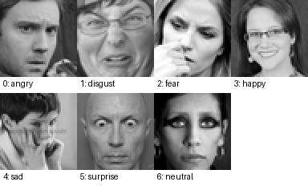
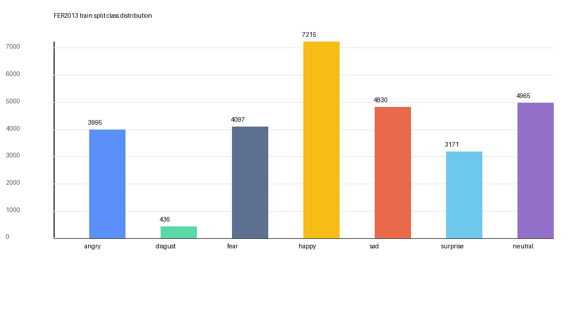

## Facial Expression Recognition with Generative Augmentation

This repository contains the working code for facial expression recognition on
FER2013 together with generative augmentation pipelines built around
conditional WGAN-GP and class-conditional diffusion models.

### Fresh Setup

From the repository root:

```bash
git submodule update --init --recursive
conda env create -f env.yaml
conda activate Self_Model
git lfs pull
```

The environment file is intentionally portable: it removes the old
machine-specific export, keeps the existing Conda environment name used by the
batch scripts, and installs both local diffusion packages in editable mode.

### Overview

The project is organised around three main tasks:

- training and evaluating a ResNet-18 FER baseline
- generating synthetic minority-class samples with WGAN and diffusion models
- filtering, curating, and replaying those synthetic samples in downstream FER experiments

----------

### Repository Layout

- `Diffusion/`: diffusion model training, sampling, and FER image conversion
- `WGAN/`: WGAN training code and generation entry points
- `analysis/`: experiment utilities for curation, filtering, training, and statistics
- `jobscripts/`: Slurm batch scripts used to run the pipelines on HPC
- `models/`: saved FER classifiers and related checkpoints
- `utils/`: small local utilities for unpacking sample archives and building contact sheets

----------

### Current Status

- ResNet-18 training and evaluation scripts are in place for FER2013.
- Diffusion training and classifier-guided sampling scripts have been updated
  for a 7-class conditional setup.
- Utility scripts now support repeatable FER image export, NPZ unpacking, and
  contact-sheet generation for synthetic sample inspection.
- Slurm job scripts have been consolidated around reproducible HPC runs.

----------

### Typical Workflow

1. Convert FER2013 CSV data into image folders with
   `jobscripts/convert_fer_images.bat` or
   `Diffusion/img-conversion/convert.py`.
2. Train or sample from the diffusion and WGAN models using the relevant
   scripts in `jobscripts/`.
3. Filter and curate synthetic outputs with the utilities in `analysis/`.
4. Train and evaluate downstream FER classifiers on the curated datasets.

See `jobscripts/README.md` for the current batch-script entry points.

----------

### FER2013 Snapshot

The training split tracked in this repo contains `28,709` labelled images.
The imbalance is strongest for `disgust`, which has only `436` examples
(`1.5%` of the train split), while `happy` has `7,215` (`25.1%`).





| Class | Train images | Share |
| --- | ---: | ---: |
| angry | 3,995 | 13.9% |
| disgust | 436 | 1.5% |
| fear | 4,097 | 14.3% |
| happy | 7,215 | 25.1% |
| sad | 4,830 | 16.8% |
| surprise | 3,171 | 11.0% |
| neutral | 4,965 | 17.3% |

These examples are rendered directly from the tracked `data/FER2013/train.csv`
file so the README stays reproducible without depending on the excluded report
artifacts or generated sample dumps.

----------

### Acknowledgements

Thanks to Ainur for supervision and guidance, and to the UoM HPC team for the
compute environment used to run the larger training and sampling jobs.
